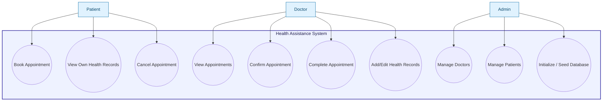
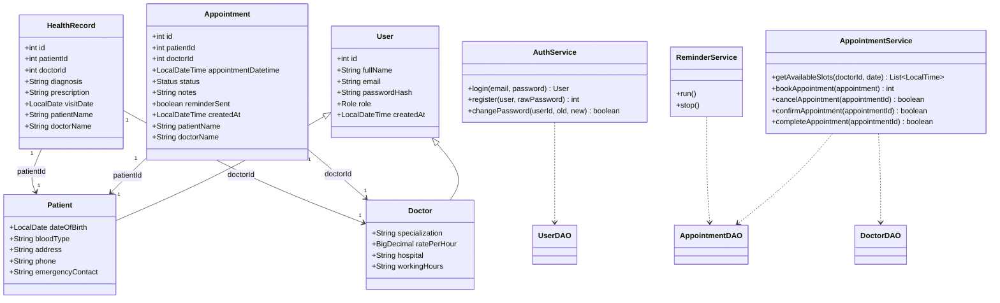
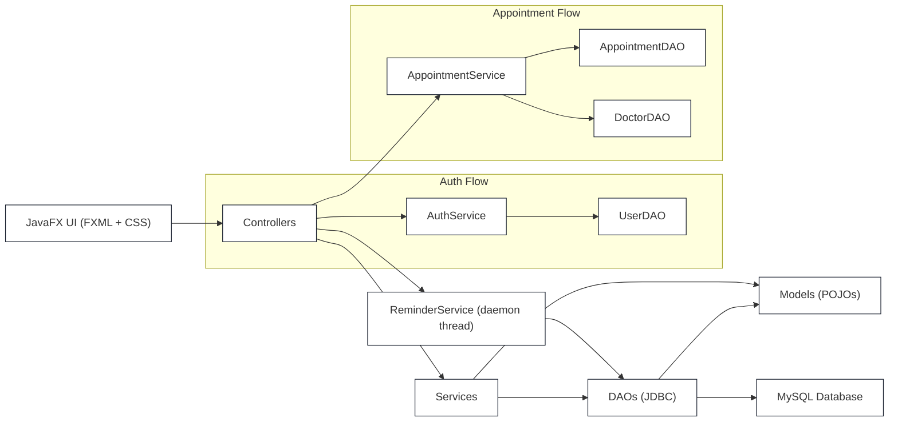

    <i>INSTITUTE OF COMPUTING TECHNOLOGY — ICTU</i> 
    <b>Department of Software Engineering/b> 
    
Academic Year 2025 – 2026

       
    <h2 style="font-weight: normal; color: #555;">Java Programming II Project Documentation</h2>
    <h1 style="color: #2C3E50; font-size: 3.5em; margin-bottom: 0px; font-weight: bold;">Health Assistance System</h1>
    <h3 style="color: #7F8C8D; margin-top: 10px;">A Comprehensive JavaFX & MySQL Medical Management Platform</h3>
        
    <table style="margin: 0 auto; width: 70%; text-align: left; font-size: 1.2em; border-collapse: collapse; border: none; background: transparent;">
        <tr>
            <td style="padding: 8px; border: none;"><strong>Author 1:</strong></td>
            <td style="padding: 8px; border: none;">AYUKEYONG DOHBILA NYAMNDI BENJUNIOR</td>
        </tr>
        <tr>
            <td style="padding: 8px; border: none; color: #555;"><strong>Matricule:</strong></td>
            <td style="padding: 8px; border: none; color: #555;">ICTU20234131</td>
        </tr>
        <tr><td colspan="2" style="border: none;">&nbsp;</td></tr>
        <tr>
            <td style="padding: 8px; border: none;"><strong>Author 2:</strong></td>
            <td style="padding: 8px; border: none;">REMMY HANS KINGKO</td>
        </tr>
        <tr>
            <td style="padding: 8px; border: none; color: #555;"><strong>Matricule:</strong></td>
            <td style="padding: 8px; border: none; color: #555;">ICTU20241966</td>
        </tr>
    </table>
       
    
<strong>Lecturer:</strong> Eng. MUGHE GODLOVE

    
<strong>Course:</strong> Java Programming II

    
<strong>Date:</strong> May 19, 2026

       
    
All source code, diagrams and documentation produced by the project team.

## Contents
- [Contents](#contents)
- [Abstract](#abstract)
- [1 Introduction](#1-introduction)
  - [1.1 Project Overview](#11-project-overview)
  - [1.2 Project Objectives](#12-project-objectives)
  - [1.3 Scope](#13-scope)
  - [1.4 Document Structure](#14-document-structure)
- [2 Software Development Life Cycle (SDLC)](#2-software-development-life-cycle-sdlc)
  - [2.1 Phase 1: Requirements Analysis](#21-phase-1-requirements-analysis)
  - [2.2 Phase 2: System Design](#22-phase-2-system-design)
  - [2.3 Phase 3: Implementation](#23-phase-3-implementation)
  - [2.4 Phase 4: Testing \& Debugging](#24-phase-4-testing--debugging)
  - [2.5 Phase 5: Deployment](#25-phase-5-deployment)
  - [2.6 Phase 6: Maintenance](#26-phase-6-maintenance)
- [3 Software Requirements Specification (SRS)](#3-software-requirements-specification-srs)
  - [3.1 Functional Requirements](#31-functional-requirements)
    - [3.1.1 User Management (FR-01)](#311-user-management-fr-01)
    - [3.1.2 Patient Management (FR-02)](#312-patient-management-fr-02)
    - [3.1.3 Doctor Management (FR-03)](#313-doctor-management-fr-03)
    - [3.1.4 Appointment Management (FR-04)](#314-appointment-management-fr-04)
    - [3.1.5 Health Record Management (FR-05)](#315-health-record-management-fr-05)
    - [3.1.6 Reports (FR-06)](#316-reports-fr-06)
  - [3.2 Non-Functional Requirements](#32-non-functional-requirements)
  - [3.3 Constraints](#33-constraints)
- [4 Software Design Document (SDD)](#4-software-design-document-sdd)
  - [4.1 Architecture Overview](#41-architecture-overview)
  - [4.2 Package Structure](#42-package-structure)
  - [4.3 Database Design](#43-database-design)
    - [4.3.1 Entity Relationship Overview](#431-entity-relationship-overview)
  - [4.4 Key Design Decisions](#44-key-design-decisions)
    - [4.4.1 Singleton Pattern for DatabaseConnection](#441-singleton-pattern-for-databaseconnection)
    - [4.4.2 AppNavigator Bridge Pattern](#442-appnavigator-bridge-pattern)
    - [4.4.3 Conflict Detection Algorithm](#443-conflict-detection-algorithm)
- [5 UML Diagrams](#5-uml-diagrams)
  - [3.6 Use Case Diagram (UML - Use Cases)](#36-use-case-diagram-uml---use-cases)
  - [3.7 Class Diagram (UML)](#37-class-diagram-uml)
  - [3.8 Component Diagram (UML - System Components)](#38-component-diagram-uml---system-components)
- [6 Code Explanation](#6-code-explanation)
  - [6.1 Model Layer](#61-model-layer)
  - [6.2 DAO Layer](#62-dao-layer)
  - [6.3 Controller Layer](#63-controller-layer)
  - [6.4 Utility \& Configuration](#64-utility--configuration)
- [7 Functionalities of the Project](#7-functionalities-of-the-project)
- [8 Difficulties and Challenges](#8-difficulties-and-challenges)
- [9 Improvements and Future Work](#9-improvements-and-future-work)
- [10 Conclusion](#10-conclusion)

## Abstract
This document constitutes the complete software engineering documentation for the Health Assistance System, a desktop application developed in Java 17 with JavaFX 21 and MySQL 8. The system provides a role-based medical management platform supporting three user types: Administrator, Doctor, and Patient. The document follows the Software Development Life Cycle (SDLC) and covers all phases from requirements elicitation through design, implementation, testing, and maintenance. It includes a full Software Requirements Specification (SRS), a Software Design Document (SDD), UML diagrams references, code explanations, difficulties encountered during development, and proposed improvements for future iterations. The system was built using the DAO (Data Access Object) architectural pattern, ensuring clean separation between the user interface, business logic, and database layers. Key features include patient and doctor management, appointment scheduling with conflict detection, health record management, and a multithreaded appointment reminder system.

## 1 Introduction

### 1.1 Project Overview
The Health Assistance System is a desktop-based medical management platform built to streamline the daily operations of modern healthcare facilities. It replaces legacy manual processes with an automated system for patient registration, doctor scheduling, electronic health records (EHR) management, and appointment bookings. It incorporates an automated background reminder thread that periodically triggers alerts for impending appointments, minimizing no-shows.

### 1.2 Project Objectives
1. Provide secure access using role-based authentication (Admin, Doctor, Patient) backed by BCrypt password hashing.
2. Ensure automated setup of databases and schema on the first system launch.
3. Facilitate appointment booking while ensuring no temporal conflicts occur in a doctor's schedule.
4. Maintain a chronological electronic health record structure, logging diagnoses and prescriptions for every patient visit.
5. Provide continuous background monitoring of upcoming appointments and push automated JavaFX alert notifications to active users.

### 1.3 Scope
The current implementation encompasses:
- A rich desktop UI using JavaFX, stylized via customized CSS.
- Layered MVC and DAO architecture.
- Core entities such as Patients, Doctors, Appointments, and Health Records securely persistently in MySQL using custom JDBC connection pooling.
- Single-system desktop deployment intended for localized use in a clinical administrative setting.

### 1.4 Document Structure
This documentation walks through the SDLC phases, detailing requirements, structural design, entity relationships, technical challenges, and possible long-term iterations.

## 2 Software Development Life Cycle (SDLC)

### 2.1 Phase 1: Requirements Analysis
In this phase, stakeholders' needs were assessed to define the core software specifications. This involved structuring user roles: Admins supervise the ecosystem, Doctors supervise their schedules and patient records, and Patients self-manage appointments. Functional scenarios like handling overbooked schedules were identified to mandate a Conflict Detection Algorithm.

### 2.2 Phase 2: System Design
The system's blueprint was formulated with an architecture heavily reliant on Separation of Concerns. The UI was decoupled into FXML templates and CSS files, the business rules abstracted to Services, and data persistence encapsulated into DAO interfaces. A relational database schema was engineered to minimize redundancy and uphold referential integrity.

### 2.3 Phase 3: Implementation
Java 17 and JavaFX 21 were employed to build the system with IntelliJ IDEA as the fundamental IDE. Maven handles lifecycle execution and dependency management. To safeguard initial usage, logic mimicking an automated Object-Relational Mapper (ORM) mapped raw JDBC ResultSet data into POJOs, with Seeders initializing the core admin and mock data.

### 2.4 Phase 4: Testing & Debugging
Rigorous manual testing was performed, targeting edge cases in the timeline view of EHRs and appointment bookings. Specific tests focused on multithreading to ensure that the Daemon-thread-driven `ReminderService` did not corrupt the `JavaFX Application Thread`, resulting in extensive utilization of `Platform.runLater()`.

### 2.5 Phase 5: Deployment
Deployment strategy focuses on local compilation via Maven plugins (e.g., `javafx-maven-plugin`). A lightweight configuration file (`config.properties`) handles changing deployment environments dynamically by maintaining database variables externally. 

### 2.6 Phase 6: Maintenance
Future adaptations mandate patching minor edge cases in connection pooling teardowns, integrating external mail APIs for out-of-system messaging, and refactoring towards full Spring Boot deployment for web scalability.

## 3 Software Requirements Specification (SRS)

### 3.1 Functional Requirements

#### 3.1.1 User Management (FR-01)
- The system must authenticate users over encrypted channels utilizing BCrypt.
- Users must be categorized conditionally (Patient, Doctor, Admin).
- The system prevents unauthorized views utilizing SessionManager session objects.

#### 3.1.2 Patient Management (FR-02)
- Allow patients to update profiles, view accessible doctors, and request appointments.
- Display a comprehensive layout of previous appointments.

#### 3.1.3 Doctor Management (FR-03)
- Enable doctors to manage schedules, approve/cancel appointments, and log comprehensive diagnoses/prescriptions into the EHR timelines after patient diagnosis.

#### 3.1.4 Appointment Management (FR-04)
- Allow appointment booking bounded by a rigorous SQL-based conflict check algorithm.
- Render dynamic temporal cards mapping the doctor's availability.

#### 3.1.5 Health Record Management (FR-05)
- Document the patient's visits accurately using historical tracking.
- Build chronological UI timelines linking all entries sequentially.

#### 3.1.6 Reports (FR-06)
- Provide admins and doctors with dashboard metrics summarizing pending, confirmed, or cancelled appointments and general facility capacities.

### 3.2 Non-Functional Requirements
- **Security**: Passwords must never be stored in plain text.
- **Reliability**: A Database Initializer ensures the app runs smoothly straight post-installation.
- **Responsiveness**: The GUI must decouple database fetch times from the rendering thread utilizing background tasks.

### 3.3 Constraints
- Developed entirely for Desktop usage (JavaFX limitations).
- Single database configuration requires uniform local network connections.

## 4 Software Design Document (SDD)

### 4.1 Architecture Overview
The software adopts Model-View-Controller mapping paired strictly with DAO integration.
Model classes define POJOs. Controllers parse FXML states. DAOs query MySQL asynchronously, returning Model lists back to controllers for visual updates via JavaFX thread delegation.

### 4.2 Package Structure
- `com.healthassist.model`: Domain classes (User, Doctor, Patient, Appointment, HealthRecord)
- `com.healthassist.dao`: JDBC persistence interactions
- `com.healthassist.service`: Business logic containing structural rules
- `com.healthassist.controller`: Event binding and data fetching delegates for JavaFX
- `com.healthassist.util`: Global utilities (SceneNavigator for view switches, AlertUtil for dialogues)
- `com.healthassist.config`: Application database properties mappings and Seeders.

### 4.3 Database Design
#### 4.3.1 Entity Relationship Overview
- `users`: Core table hosting auth mappings.
- `patients`, `doctors`: Child tables linking 1-to-1 against users storing role-specific parameters.
- `appointments`: Cross-linking patients with doctors under strict timestamp schemas.
- `health_records`: Mapping chronological logs.

### 4.4 Key Design Decisions
#### 4.4.1 Singleton Pattern for DatabaseConnection
An abstract pool maintains steady, reliable connection lifecycles across concurrent application threads.

#### 4.4.2 AppNavigator Bridge Pattern
A centralized visual routing engine (`SceneNavigator`) swaps out core dashboard nodes cleanly overriding previous scenes.

#### 4.4.3 Conflict Detection Algorithm
When saving an appointment, a bounded query dynamically compares overlap deltas in temporal SQL fields guaranteeing that no two patients lock the exact same 1-Hour slot per doctor.

## 5 UML Diagrams
### 3.6 Use Case Diagram (UML - Use Cases)

> **Actors:** Patient, Doctor, Admin  
> **System:** Health Assistance System (JavaFX desktop + MySQL backend)

### 3.7 Class Diagram (UML)

### 3.8 Component Diagram (UML - System Components)

---

## 6 Code Explanation

### 6.1 Model Layer
Contains entity projections like `Patient.java` maintaining local primitive properties mirroring SQL table typings.

### 6.2 DAO Layer
Interfaces managing robust PreparedStatement workflows reducing SQL injection probability. E.g., `AppointmentDAO.java` orchestrates CRUD flows.

### 6.3 Controller Layer
Injects `.fxml` hooks (`@FXML`) coordinating visual components based on `SessionManager` scopes dynamically. 

### 6.4 Utility & Configuration
Custom utilities like `DateUtil.java` structure ISO chronologies to JavaFX local bindings. The `DatabaseInitializer.java` auto-executes the raw schema string bypassing physical MySQL client initialization procedures.

## 7 Functionalities of the Project
- One-click launch with zero preliminary database imports (Auto Initialization).
- Granular RBAC enforcing Doctor capabilities distinctly from Patient capabilities.
- Live Daemon appointment monitoring alerting system.
- Chronological EHR tracking visualization UI.

## 8 Difficulties and Challenges
- **Multithreading UI Safety:** Integrating background daemons (`ReminderService`) necessitated exact threading synchronisations via `Platform.runLater()` to avoid `IllegalStateException`.
- **Packaging/Modularity Errors:** Resolving `module-info.java` constraints versus non-modular Jars (like `jbcrypt.jar`) requiring strict automatic module bindings.
- **JavaFX Build Constraints:** Maven Shade/JavaFX Plugins necessitated precise runtime arguments.

## 9 Improvements and Future Work
- Shift to Web Architecture utilizing Spring Boot API frameworks.
- Deploy Postgres or Cloud Database models.
- Externalize alerts via robust Email or SMS APIs using real external SMTP channels.

## 10 Conclusion
The Health Assistance System represents an encapsulated, highly engineered desktop solution bridging practical architectural patterns (MVC, DAO) with robust database integration and asynchronous multithreading UI handling, fully succeeding in standardizing clinical administrative bottlenecks.
