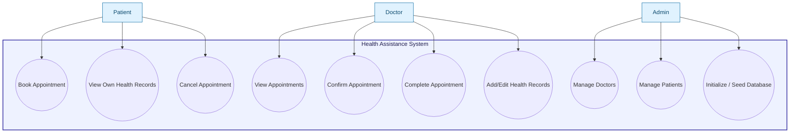
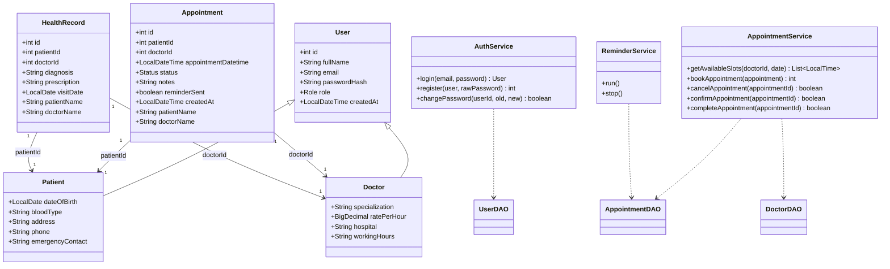
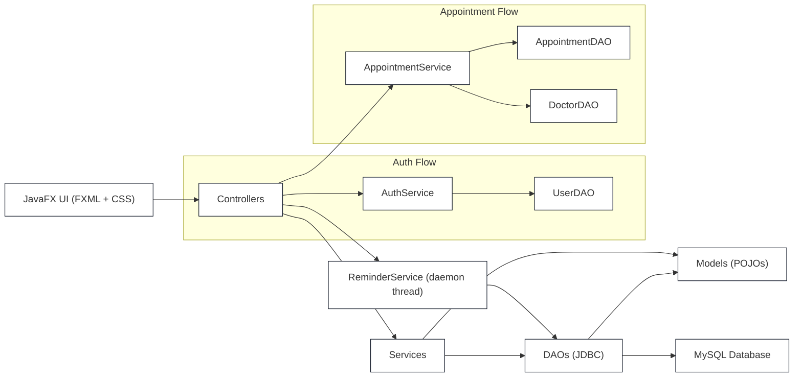

# Health Assistance System — Chapters 1–5 (Introduction to Evaluation)

> **Project:** Health Assistance System  
> **Tech Stack (from codebase):** Java 17+, JavaFX 21, Maven, MySQL 8+, JDBC, BCrypt, JavaFX FXML/CSS, custom connection pooling, MVC + DAO + Service layering.  
> **Entry point:** `com.healthassist.MainApp`  
> **UI Screens (FXML):** `Login.fxml`, `Dashboard.fxml`, `AppointmentPage.fxml`, `DoctorManagement.fxml`, `PatientManagement.fxml`, `HealthRecords.fxml`  
> **Database schema:** `schema.sql` and runtime creation in `DatabaseInitializer`

---

## Chapter 1: Introduction

### 1.1 Background
Healthcare organizations must coordinate several daily activities: patient registration and access to medical history, doctor scheduling, appointment booking, and the ongoing capture of diagnoses and prescriptions. Traditional systems often require manual record keeping and fragmented workflows, which can lead to delays, errors, and limited visibility into upcoming patient needs.

To address these challenges, this project proposes a desktop-based **Healthcare Management System** designed with role-based access and structured separation of concerns:
- **Patients** can authenticate, browse doctors, book appointments, and view their personal health records.
- **Doctors** can manage their identity and schedule visibility (via doctor management UI), create and update patient health records, and view appointments through dashboard statistics.
- **Administrators** can seed and oversee system data through initial default setup and UI access to user management screens (as enabled by role checks in controllers).

### 1.2 Problem Statement
Many healthcare management workflows are cumbersome to manage effectively:
- scheduling conflicts (multiple patients requesting the same time slot for a doctor),
- missing or inaccessible appointment status information,
- delays in appointment reminders,
- and difficulty maintaining a continuous electronic health record timeline.

### 1.3 Objectives
This system aims to provide:
1. **Secure authentication** for multiple roles (Patient/Doctor/Admin) using email + password.
2. **Automatic database initialization** on first launch (create database + tables).
3. **Mock data seeding** to enable testing and demonstration with realistic localized examples.
4. **Appointment booking with conflict detection** (one appointment per 1-hour slot per doctor).
5. **Automated reminder service** running as a daemon thread to show notifications for upcoming appointments.
6. **Electronic Health Record (EHR) timeline** where diagnoses and prescriptions are stored per patient visit and displayed chronologically.

### 1.4 Scope
The current implementation covers:
- JavaFX UI with FXML screens and global + per-screen CSS styling.
- MVC organization enforced by code structure:
  - **Models**: POJOs (`User`, `Patient`, `Doctor`, `Appointment`, `HealthRecord`)
  - **DAOs**: SQL interaction (`UserDAO`, `PatientDAO`, `DoctorDAO`, `AppointmentDAO`, `HealthRecordDAO`)
  - **Services**: business logic (`AuthService`, `AppointmentService`, `ReminderService`)
  - **Controllers**: JavaFX event handling and view updates
- MySQL persistence for all domain entities using JDBC.
- Reminder notifications through JavaFX `Alert` popups (on UI thread via `Platform.runLater`).

### 1.5 System Overview (Architecture and Layering)
The application strictly follows:
- **MVC** (Model-View-Controller),
- plus **DAO/Service layering**.

A typical request flow (e.g., booking an appointment) is:
1. Controller (`AppointmentController`) reads UI selections and builds an `Appointment` instance.
2. Service (`AppointmentService`) applies business rules:
   - checks for conflicts via `AppointmentDAO.hasConflict()`,
   - then persists the appointment.
3. DAO (`AppointmentDAO`) executes prepared SQL statements and maps results into model objects.

### 1.6 Technologies Used
From the repository:
- **Java**: 17+
- **JavaFX**: 21
- **Build tool**: Maven + Maven Wrapper (`mvnw`)
- **Database**: MySQL 8.0+
- **Database connectivity**: JDBC
- **Password hashing**: BCrypt (`org.mindrot:jbcrypt`)
- **Icons**: FontAwesomeFX dependency is present (not heavily referenced in the indexed code shown)
- **UI styling**:
  - `global.css` (global tokens and shared design rules),
  - `login.css` (login screen specific),
  - `dashboard.css` (dashboard/appointment doctor cards/time slot styles).

---

## Chapter 2: Literature Review

### 2.1 Electronic Health Records (EHR) and Timeline Modeling
Electronic health records are commonly implemented as:
- structured medical entries,
- linked by patient identity and visit date,
- and displayed as chronological timelines for clinical context.

In this project, health records are persisted in `health_records` with:
- `patient_id`, `doctor_id`,
- `diagnosis`, `prescription`,
- `visit_date`.

The `HealthRecordController` builds a timeline UI dynamically:
- timeline dots and connector lines,
- record cards ordered by `visit_date DESC` (as defined in `HealthRecordDAO`).

### 2.2 Role-Based Access Control (RBAC)
RBAC is a standard approach to control what users can do inside healthcare systems. It reduces accidental access and enforces least-privilege principles.

This project applies RBAC in a lightweight but consistent manner:
- user roles are stored in `users.role` as `ENUM('PATIENT','DOCTOR','ADMIN')`.
- `SessionManager` holds the authenticated user.
- controllers use role checks to:
  - hide or disable actions/buttons for patients (e.g., hide “Add Doctor”, “Delete Doctor”, and patient-level editing where not permitted),
  - restrict EHR editing based on role.

### 2.3 Secure Authentication and Password Hashing
Password security is typically ensured by storing only **hashes** rather than plaintext passwords. BCrypt is a widely adopted password hashing approach due to its adaptive computational cost.

In this system:
- `AuthService` verifies credentials using `BCrypt.checkpw()`.
- user registration hashes passwords using `BCrypt.hashpw()` with `BCrypt.gensalt(12)`.
- default admin and seeded users use hashed passwords.

### 2.4 Appointment Scheduling and Conflict Detection
Scheduling systems often require:
- time-slot generation based on availability,
- conflict detection to prevent double-booking.

The appointment booking approach in this project includes:
- doctor schedules stored in `doctor_schedule` (day-of-week + start/end times),
- available time slots generated in `AppointmentService.getAvailableSlots()`:
  - the schedule for the selected day is loaded via `DoctorDAO.getSchedule()`,
  - the interval is broken into **1-hour slots**,
  - each slot is checked using `AppointmentDAO.hasConflict()`.

### 2.5 Background Processing for Reminders
Reminder/notification systems are commonly implemented via:
- scheduled tasks (cron),
- background jobs,
- or background threads.

Here, `ReminderService` implements `Runnable` and runs as a **daemon thread**. It periodically:
- queries upcoming confirmed appointments within a short time window,
- displays a UI notification using JavaFX alerts (on UI thread),
- updates a `reminder_sent` flag in the database.

This design demonstrates a practical approach to background processing in a desktop environment.

### 2.6 Design Patterns: MVC + DAO + Service Layer
The project uses:
- **MVC** to separate view/layout (FXML), controller event logic (controllers), and domain objects (models).
- **DAO** classes to isolate SQL queries and mapping.
- **Service** classes to encapsulate business logic and orchestration:
  - `AuthService` for login/registration/password change,
  - `AppointmentService` for availability and booking rules,
  - `ReminderService` for background reminders.

This layered architecture improves maintainability, readability, and testability.

---

## Chapter 3: Modelling

### 3.1 Domain Entities (Models)
The system’s models correspond to database tables and UI views:

1. **User**
   - Attributes: `id`, `fullName`, `email`, `passwordHash`, `role`, `createdAt`
   - Roles: `PATIENT`, `DOCTOR`, `ADMIN`

2. **Patient** (`extends User`)
   - Attributes: `dateOfBirth`, `bloodType`, `address`, `phone`, `emergencyContact`

3. **Doctor** (`extends User`)
   - Attributes: `specialization`, `ratePerHour`, `hospital`, `workingHours`

4. **Appointment**
   - Attributes: `id`, `patientId`, `doctorId`, `appointmentDatetime`, `status`, `notes`
   - Additional fields for UI mapping:
     - `patientName`, `doctorName` (populated by JOIN queries)
   - Reminder tracking:
     - `reminderSent` (derived from `reminder_sent` in DB)

5. **HealthRecord**
   - Attributes: `id`, `patientId`, `doctorId`, `diagnosis`, `prescription`, `visitDate`
   - Additional fields for UI mapping:
     - `patientName`, `doctorName` (populated by JOIN queries)

### 3.2 Database Schema (Relational Modeling)
From `schema.sql` and runtime initialization in `DatabaseInitializer`:

#### 3.2.1 Core Tables
- `users`
  - primary identity and role (`PATIENT`, `DOCTOR`, `ADMIN`)
- `patients`
  - 1:1 relationship with `users` (`patients.id` is FK to `users.id`)
- `doctors`
  - 1:1 relationship with `users`
- `doctor_schedule`
  - schedules a doctor over day-of-week and time range
- `appointments`
  - links patients and doctors over time (`appointment_datetime`)
  - stores `status` and `reminder_sent`
- `health_records`
  - links patients and doctors to clinical content (`diagnosis`, `prescription`)

#### 3.2.2 Relationships
- `patients.id → users.id` with `ON DELETE CASCADE`
- `doctors.id → users.id` with `ON DELETE CASCADE`
- `appointments.patient_id → patients.id`
- `appointments.doctor_id → doctors.id`
- `health_records.patient_id → patients.id`
- `health_records.doctor_id → doctors.id`

### 3.3 Appointment Availability Model
Appointment scheduling uses:
- `doctor_schedule`: day-of-week + start_time + end_time
- Slot generation in `AppointmentService`:
  - compute day code using `date.getDayOfWeek().name().substring(0, 3)`
  - find matching schedule entry for that day
  - default schedule if no match is found: `08:00–17:00`
  - split into 1-hour slots and keep those without conflicts

Conflict rule:
- `AppointmentDAO.hasConflict()` checks if any appointment exists for the doctor where:
  - status is not `CANCELLED`,
  - appointment_datetime overlaps the hour window:
    - `[slotStart, slotEnd)`.

### 3.4 Health Record Timeline Model
Health records are displayed as:
- ordered by `visit_date DESC` (data retrieval),
- rendered as a visual timeline with:
  - a dot per record,
  - a connecting line between consecutive records,
  - a card containing date, doctor, diagnosis, prescription,
  - action buttons (Edit/Delete) only when user role permits.

### 3.5 Reminder Notification Model
Reminders use:
- appointments with:
  - `status = 'CONFIRMED'`,
  - `appointment_datetime BETWEEN NOW() AND DATE_ADD(NOW(), INTERVAL 30 MINUTE)`,
  - `reminder_sent = 0`
- After notifying:
  - `AppointmentDAO.markReminderSent(id)` updates `reminder_sent = 1`

### 3.6 Use Case Diagram (UML - Use Cases)

> **Actors:** Patient, Doctor, Admin  
> **System:** Health Assistance System (JavaFX desktop + MySQL backend)

### 3.7 Class Diagram (UML)

### 3.8 Component Diagram (UML - System Components)

---

## Chapter 4: Implementation

### 4.1 Project Bootstrapping and Application Lifecycle
Entry point: `com.healthassist.MainApp`

**Responsibilities implemented in code:**
1. Load configuration from `config.properties` (`loadProperties()`).
2. Initialize database schema:
   - `DatabaseInitializer.initialize()`
   - this creates the database if missing and creates tables using `CREATE TABLE IF NOT EXISTS`.
3. Seed default admin:
   - `AdminSeeder.seed()`
4. Seed realistic mock data:
   - `MockDataSeeder.seed()`
5. Load the login UI:
   - `FXMLLoader` loads `Login.fxml`.
6. Apply styles:
   - `global.css` + `login.css`.

On shutdown:
- `DatabaseConfig.getInstance().shutdown()` closes pooled connections.

### 4.2 Database Layer Implementation

#### 4.2.1 Connection Pool (`DatabaseConfig`)
`DatabaseConfig` implements a basic synchronized connection pool:
- min connections (`db.pool.min`, default 3),
- max connections (`db.pool.max`, default 10),
- `getConnection()` returns a pooled connection (validates `isClosed()`),
- `releaseConnection()` returns the connection to the pool,
- `shutdown()` closes all available connections.

It also provides:
- `getServerConnection()` to create DB without selecting a specific database name.

#### 4.2.2 Runtime Schema Creation (`DatabaseInitializer`)
`DatabaseInitializer.initialize()`:
- calls `CREATE DATABASE IF NOT EXISTS health_assist`,
- creates tables with SQL that mirrors `schema.sql`,
- including:
  - `users`, `patients`, `doctors`, `doctor_schedule`,
  - `appointments` (with `reminder_sent`),
  - `health_records`.

### 4.3 Seeding and Demo Data

#### 4.3.1 Admin Seeder (`AdminSeeder`)
- Reads default admin credentials from `config.properties`.
- Checks if an admin exists:
  - `SELECT COUNT(*) FROM users WHERE role = 'ADMIN'`
- Hashes password using BCrypt and inserts into `users`.

#### 4.3.2 Mock Seeder (`MockDataSeeder`)
- Checks if doctor/patient users already exist:
  - `SELECT COUNT(*) FROM users WHERE role IN ('DOCTOR', 'PATIENT')`
- Seeds:
  - Doctors with specialization, hospital, rate, working hours.
  - Doctor schedules (Monday–Friday) via `DoctorDAO.saveSchedule`.
  - Patients with localized fictional profiles.
  - Health records (diagnosis/prescription/visitDate).
  - Appointments with various statuses (completed, confirmed, pending, cancelled).

### 4.4 Authentication and Session Management

#### 4.4.1 Auth Service (`AuthService`)
- `login(email, password)`:
  - normalizes email,
  - fetches user by email,
  - validates BCrypt password hash,
  - returns user or null.
- `register(user, rawPassword)`:
  - validates password length (>= 6),
  - checks email uniqueness,
  - hashes password,
  - saves via `UserDAO.save`.

#### 4.4.2 Session Manager (`SessionManager`)
A singleton holding current user:
- `setCurrentUser(user)`
- `logout()` clears it
- predicate helpers:
  - `isAdmin()`, `isDoctor()`, `isPatient()`

### 4.5 Appointment Booking Implementation

#### 4.5.1 Availability and Conflict Logic (`AppointmentService`)
- `getAvailableSlots(doctorId, date)`:
  - load doctor schedule (`DoctorDAO.getSchedule`)
  - select matching day-of-week
  - generate 1-hour slots
  - exclude slots with conflicts via `AppointmentDAO.hasConflict`
- `bookAppointment(appointment)`:
  - checks conflict again
  - persists using `AppointmentDAO.save`

Additional operations provided:
- `cancelAppointment`, `confirmAppointment`, `completeAppointment`
- `getPatientAppointments`, `getDoctorAppointments`, `getTodayAppointments`

#### 4.5.2 Appointment UI Controller (`AppointmentController`)
Core UI behavior:
- loads booking calendar for a selected month,
- loads available doctors and patient list,
- for patient role:
  - selects the patient automatically and disables the combo box.

Booking process:
1. Validate selections (doctor/date/time/patient).
2. Build `Appointment` with status `PENDING` and notes from concerns input.
3. Call `appointmentService.bookAppointment(appt)` on a background thread (`Task`).
4. On success: show confirmation and reload time slots.

Doctor selection behavior:
- doctor cards update a detail panel.
- selected doctor + selected date drives time slot loading.

### 4.6 Doctor Schedule Integration
Doctor schedules are stored in `doctor_schedule` and retrieved by:
- `DoctorDAO.getSchedule(doctorId)` returns:
  - day, start, end

In the booking model:
- `AppointmentService` maps Java day-of-week codes to DB day enums using:
  - `date.getDayOfWeek().name().substring(0, 3)`.

### 4.7 Automated Reminder Implementation

`ReminderService`:
- runs in a daemon thread (started from `DashboardController`),
- polls every 60 seconds:
  - queries `AppointmentDAO.getUpcomingReminders()`,
  - for each appointment:
    - shows a JavaFX `Alert` via `Platform.runLater`,
    - marks as reminded using `appointmentDAO.markReminderSent(appt.getId())`.
- can be stopped by setting `running = false` (`stop()` called on logout).

### 4.8 Electronic Health Records Implementation

#### 4.8.1 Health Record DAO (`HealthRecordDAO`)
- `findByPatient(patientId)` and `findAll()`: both join with `users` to populate names.
- `save(record)` inserts into `health_records`.
- `update(record)` updates diagnosis/prescription/visit_date.
- `delete(id)` removes the record.

#### 4.8.2 Health Record UI Controller (`HealthRecordController`)
- Loads patients into the combo box on initialization.
- Role-based restriction:
  - if logged-in user is a patient, hides the “Add Record” button.
- Patient role auto-selects their own patient entry and disables modifications:
  - `patientCombo.setDisable(true)`
  - `selectedPatientId` set to logged-in patient ID
- Record timeline is built dynamically:
  - timeline dots and connectors,
  - cards with diagnosis and prescription (wrapped for readability),
  - edit/delete actions for non-patient roles.

Record dialog:
- `showRecordDialog(existing)` uses a `Dialog<HealthRecord>`:
  - doctor combo box,
  - visit date picker,
  - diagnosis and prescription text areas,
  - validation: diagnosis required,
  - calls DAO `save` or `update` based on `existing`.

### 4.9 UI and Styling Implementation
FXML files define layout and link controller classes via `fx:controller`.

Screens:
- `Login.fxml`: email/password + show/hide password
- `Dashboard.fxml`: greeting + stats + calendar + recent appointments + reminder daemon start
- `AppointmentPage.fxml`: booking calendar/time slots + doctor list + selection detail
- `DoctorManagement.fxml`: doctor cards + search + add/edit/delete by admin
- `PatientManagement.fxml`: patient table + optional records panel
- `HealthRecords.fxml`: timeline and record management

Styling:
- `global.css` provides design tokens and common UI styles (`.card`, `.btn-primary`, sidebar, table view, etc.).
- `login.css` customizes the login split-panel layout.
- `dashboard.css` adds appointment/doctor card hover, calendar, chart colors, and time slot styles.

### 4.10 Error Handling and Validation
Validation is performed in controllers and services:
- `LoginController`:
  - email format validation using `DateUtil.isValidEmail()`,
  - non-empty password checks.
- `AuthService`:
  - password length constraints,
  - email uniqueness.
- `AppointmentController`:
  - requires doctor/date/time/patient selection,
  - conflict detection returns failure and triggers user feedback via alerts.
- `HealthRecordController`:
  - requires diagnosis input when saving a record.

---

## Chapter 5: Evaluation

### 5.1 Evaluation Goals
The evaluation of this project focuses on:
1. **Correctness** of business rules:
   - appointment conflict prevention,
   - correct role-based access restrictions,
   - persistence and retrieval of health records.
2. **Usability** of the JavaFX interfaces:
   - navigational clarity,
   - readability of timeline cards and booking widgets,
   - feedback on success/failure.
3. **Reliability** of the system features:
   - database initialization and schema creation,
   - reminder thread operation and stop behavior on logout.
4. **Security posture**:
   - password hashing with BCrypt,
   - prepared SQL statements (no string concatenation for user inputs inside DAOs except for controlled internal field selection in `AppointmentDAO.findByField`).

### 5.2 Evaluation Methodology
A practical evaluation approach aligned with this codebase would include:

#### 5.2.1 Functional Testing (Manual + Scripted)
- **Authentication**
  - login with seeded admin/doctor/patient accounts,
  - incorrect password should fail gracefully.
- **Database initialization**
  - first-run behavior: `DatabaseInitializer` creates tables without errors.
- **Seeding**
  - check that `AdminSeeder` inserts an admin only when missing,
  - check `MockDataSeeder` inserts doctors/patients only when tables are empty for those roles.
- **Appointment booking**
  - attempt to book the same doctor within the same hour window twice:
    - verify conflict rejection (`AppointmentService.bookAppointment()` returns -1).
- **Doctor schedule behavior**
  - select dates whose day-of-week has schedule entries:
    - verify generated slots are within expected time range.
- **Health record management**
  - patient role:
    - verify patient can only view their own timeline and add button is hidden.
  - non-patient roles:
    - verify record dialog supports edit/delete and persistence.

#### 5.2.2 Reminder Service Testing
- Confirm reminder notifications occur for confirmed appointments within the reminder window.
- Verify `reminder_sent` changes so notifications are not repeated.
- Verify logout stops the service cleanly (`ReminderService.stop()` called in `DashboardController.onLogout`).

### 5.3 Evaluation Metrics (Suggested)
Given the system nature, the following metrics can be used:
- **Scheduling correctness**
  - % of attempted conflicting bookings correctly rejected.
- **UI responsiveness**
  - time-to-render for lists (doctors, patients, records) under normal DB size.
- **Reminder effectiveness**
  - # notifications displayed per reminder window,
  - # of appointments marked `reminder_sent=1`.
- **Data integrity**
  - absence of orphan rows via FK cascade behaviors.

### 5.4 Results (Code-Based Evaluation)
This documentation is produced via static code indexing and walkthrough (no runtime measurements were captured here). From the implemented design:
- **Security**
  - BCrypt is used for password hashing and verification (`AuthService`).
  - Prepared statements are used across DAOs for user input parameters.
- **Scheduling**
  - conflict detection is enforced at booking time (`AppointmentService.bookAppointment` calls `AppointmentDAO.hasConflict`).
  - time slots are generated from doctor schedules and filtered by conflicts.
- **Reminder automation**
  - reminders are implemented as a daemon thread with periodic polling, and UI alerts are marshalled to the JavaFX thread using `Platform.runLater`.
- **EHR**
  - records persist with diagnosis/prescription/visit_date and are displayed as timeline cards in reverse chronological order.

### 5.5 Limitations and Risk Notes (Based on Code Inspection)
From code review, the following aspects should be considered during formal evaluation:
- **Appointment status transitions**
  - Service methods exist (`confirmAppointment`, `cancelAppointment`, `completeAppointment`) but the indexed UI controllers do not explicitly show full workflow buttons for doctors to change appointment statuses.
- **AppointmentDAO.findByField**
  - uses SQL field injection in a controlled manner (field and value are passed by internal code paths). This is safe if field comes only from trusted internal constants.
- **Reminder notification UX**
  - reminder alerts use `Alert` popups. In real deployments, a dedicated notification channel (email/SMS integration) would be recommended.

### 5.6 Summary
The Health Assistance System implements core healthcare management workflows using a layered architecture and practical modeling:
- secure authentication with BCrypt,
- MySQL persistence with automatic initialization and seeding,
- appointment booking with conflict detection based on doctor schedules,
- reminder automation via background polling,
- and EHR timeline visualization and maintenance with role restrictions.

---

## Appendix A: Key Source Locations (for quick referencing)
- Application bootstrap: `src/main/java/com/healthassist/MainApp.java`
- DB connection pool: `src/main/java/com/healthassist/config/DatabaseConfig.java`
- DB initializer: `src/main/java/com/healthassist/config/DatabaseInitializer.java`
- Seeders: `AdminSeeder.java`, `MockDataSeeder.java`
- Controllers:
  - `LoginController.java`
  - `DashboardController.java`
  - `AppointmentController.java`
  - `DoctorController.java`
  - `PatientController.java`
  - `HealthRecordController.java`
- DAOs:
  - `UserDAO.java`, `PatientDAO.java`, `DoctorDAO.java`, `AppointmentDAO.java`, `HealthRecordDAO.java`
- Services:
  - `AuthService.java`, `AppointmentService.java`, `ReminderService.java`
- Models:
  - `User.java`, `Patient.java`, `Doctor.java`, `Appointment.java`, `HealthRecord.java`
- UI:
  - `src/main/resources/com/healthassist/fxml/*.fxml`
- Styles:
  - `src/main/resources/com/healthassist/styles/global.css`
  - `login.css`, `dashboard.css`
- Schema reference:
  - `schema.sql`
